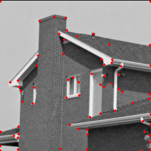
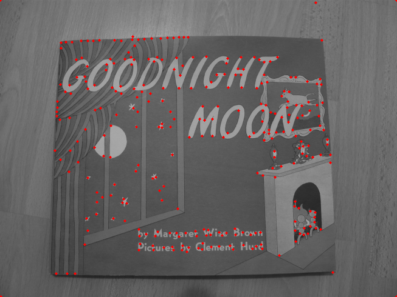
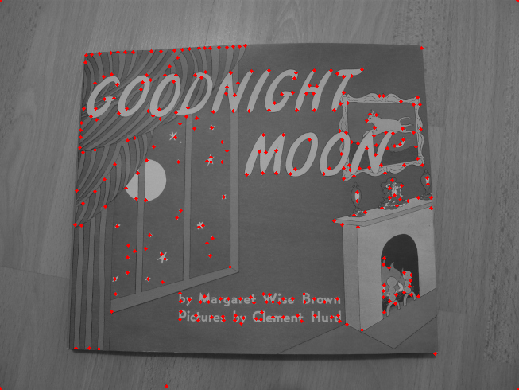
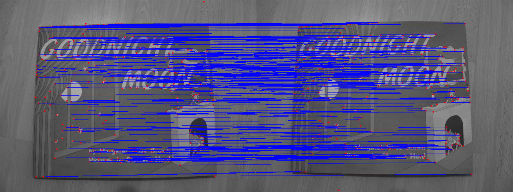
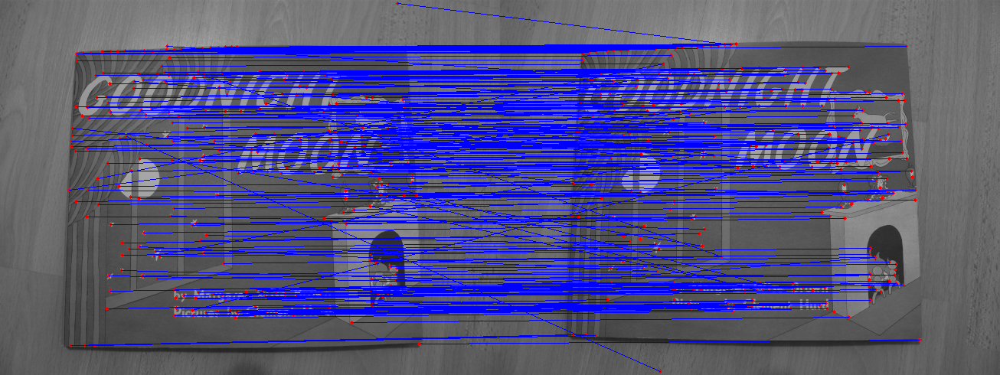
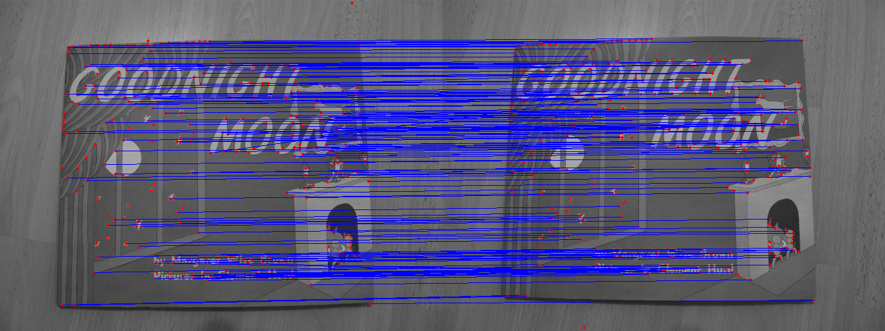

# Local Features Detection and Matching

This file contains the implementation of Harris Corner Detection and feature matching techniques for detecting and matching local features in images. The project explores image processing methods and hyperparameter tuning to achieve optimal results.

## Content

### 1. Harris Corner Detection
- **Gradient Calculation**: Utilized Sobel kernels to compute image gradients in the x and y directions.
- **Gaussian Blurring**: Applied GaussianBlur with an adapted kernel to smooth the image.
- **Corner Detection**: Calculated the Harris response function and applied non-maximum suppression using `maximum_filter`.
- **Thresholding and Filtering**: Identified and filtered strong corners based on threshold and neighborhood constraints.

  

  
  

### 2. Description and Matching
- **Keypoint Filtering**: Removed keypoints near the image borders based on patch size.
- **Descriptor Matching**:
  - **One-way matching**: Match descriptors by finding the nearest neighbor in one direction.
  - **Two-way matching**: Match descriptors by finding mutual nearest neighbors for more robust results.
  - **Ratio Test**: Applied a ratio test to identify pairs with high matching confidence.
<!-- Single row of images for Matching -->

  
  
  

## Results
- Optimized Harris corner detection by adjusting hyperparameters:
  - Harris response constant (`k`)
  - Threshold for corner selection
  - Window sizes and Gaussian blur parameters
- Explored matching techniques to optimize results, highlighting the stability and accuracy of the ratio test compared to other methods.