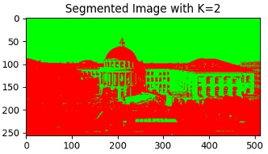
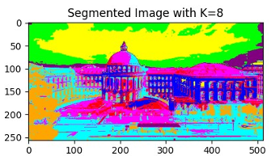
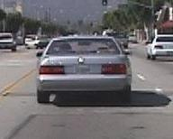
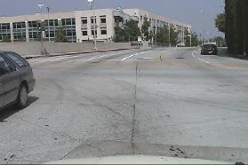

# Object Recognition using K-means and Bag-of-Words

This project implements **Bag-of-Words (BoW) classifier** for object recognition, specifically for car detection in images. The project explores feature extraction, clustering, and nearest-neighbor classification to achieve effective recognition results.

## Overview

The project consists of two main tasks:

1. **K-means Clustering**: Used to construct the Visual words.
2. **Bag-of-Words Image Classification**: A machine learning-based approach for recognizing objects in images using local feature extraction and clustering.

## K-means Clustering

K-means clustering is applied to segment an image into K clusters:

1. **Initialization**: Randomly selects K centroids.
2. **Point Distance Calculation**: Computes Euclidean distance between each pixel and centroids.
3. **Cluster Assignment & Update**: Assigns each pixel to the nearest centroid and updates centroids based on pixel averages.
4. **Iterations**: The process repeats until convergence.

### Example Results:

- **K = 2** → Segments image into light and dark areas.
- **K = 3, 5, 8, 10** → Finer segmentation with more object detail.
- **K = 20** → We start to basically just remap the colors.

  
  
  

---

## Bag-of-Words Classification

The Bag-of-Words classifier follows these steps:

1. **Local Feature Extraction**: Uses a grid-based approach to extract feature points.
2. **Feature Description**: Computes Histogram of Oriented Gradients (HOG) descriptors for local features.
3. **Codebook Construction**: Uses K-means clustering to create a dictionary of "visual words."
4. **Bag-of-Words Vector Encoding**: Converts images into histograms of visual word occurrences.
5. **Nearest Neighbor Classification**: Classifies test images based on similarity to training histograms.

### Example Results:

- **Bag-of-Words Classification Performance**
  
  - Achieves high accuracy for car detection.
  - First occurrence of **100% accuracy** on testing set at **K = 10**.

The Classifier distinguisches perfectly between positive image (images with cars), and negative images.

  
  

